# Ida Puggaard
MSc in Mathematical Modelling and Computation from DTU

Copenhagen, Denmark 

[idapug7658@gmail.com](mailto:idapug7658@gmail.com)

# Selected Projects
## Master Thesis: 3D Medical Image Segmentation Using DINO Feature Representations
*Supervised by Anders Bjorholm Dahl and William Michael Laprade *

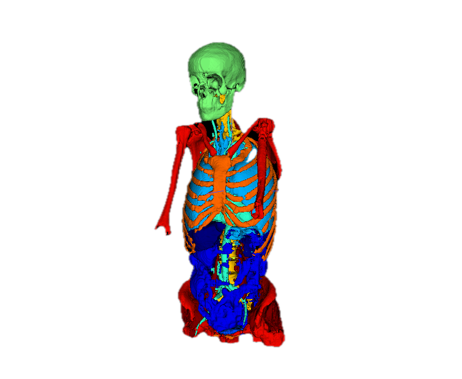

The project investigated how feature representations from the vision transformer foundation model DINOv3 could be utilised to improve 3D medical image segmentation when integrated into traditional U-Net architecture. The goal of the project was to create a model that could produce accurate segmentations, while relying on small amount of manually annotated training data.

 

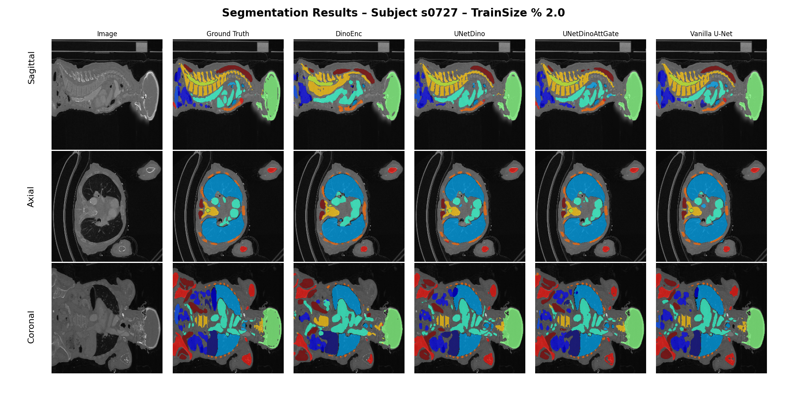

The conclusion of the project were the development and evaluation of 3 different models that were able to predict full body 3D CT volumes. 
The full project and the final report can be found in the [Github repostery](https://github.com/IdaPug/3D-Medical-Image-Segmentation-Using-DINO-Feature-Representations)

 

__Skills__: Deep Learning, Computer Vision, Vision Transformers, 3D data, Raw data processing, Feature Fusion, U-Net, Self-Supervised Learning, Python, PyTorch, HPC

## Bachelor Thesis: Signal to noise properties in 4D hyperspectral x-ray datasets  
*Supervised by Jakob Sauer Jørgensen and Ulrik Lund Olsen*

The project investigated the impact of different acquisitions parameters on reconstruction quality in hyperspectral X-ray imaging. The goal of the projects was to determine optimal acquisition configurations and demonstrating how different figure of merit on assessing reconstruction quality. 
The full project and the final report can be found in the [Github repostery](https://github.com/IdaPug/Bachelor_project_2023)

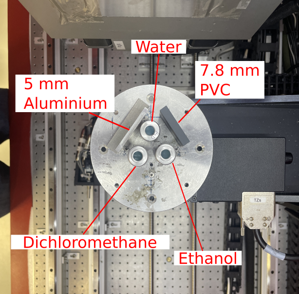 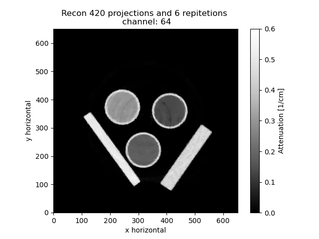 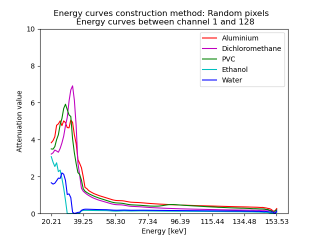

The main work of the project was done using the Core Imaging Library (CIL) python library and therefore was an additional objective of the project to establish a CIL workflow tailored to hyperspectral X-ray projection for future users. This have en demostrated to a [notebook](https://github.com/TomographicImaging/CIL-User-Showcase/blob/main/007_Hyperspectral_regularisation/Hyperspectral_regularisation.ipynb), which was developed during the CCPI: CIL Training and Bring You Own Data User Hackathon, which I was invited to participate in.

__Skills__: Inverse Problems & Regularisation, Scientific Computing, Noisy data, Python, Computed Tomography, Optimization, Data Analysis, Qualitative image analysis

## Disaster Tweet Classification: MLOps Project
*Project following the Machine Learning Operations Course*
Built and deployed a full NLP classification pipeline end-to-end. The focus was to learn production ML engineering practices rather than just model development. Fine-tuned a DistilBERT-based classifier to detect whether a tweet describes a real disaster or not. Wrapped the model in a complete production system: automated testing and linting via GitHub Actions, Docker containerization, data versioning with DVC linked to cloud storage, and a live deployment on Google Cloud Run serving both an API and a Streamlit frontend. The full Github repository and frontend can be found at [Github repostery](https://github.com/IdaPug/MLOps_Project_NLP_DisasterTweets/tree/main)
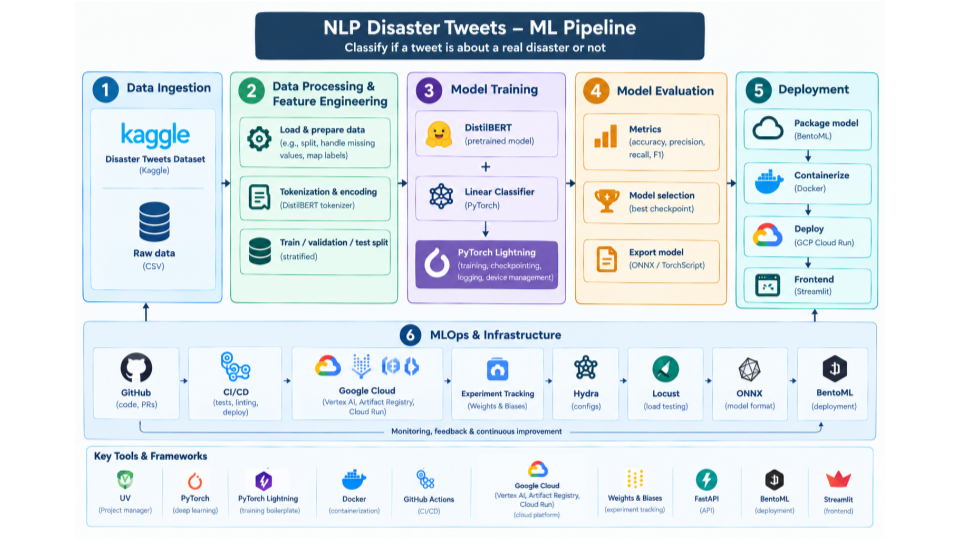 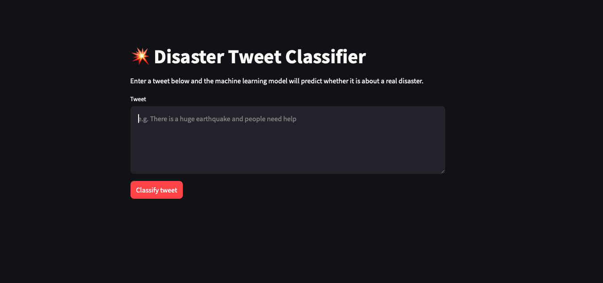

__Skills__: MLOps, CI/CD, Docker, Unit testing, Debugging & Profiling, Google Cloud Platform, FastApi, DVC, Git

## Model Based Machine Learning: Hierarchical regression: Movie preferences
*Group project for the course: 42186 Model-based machine learning*
I participated in a project on movie ratings predictions. The projects explored how hierarchical regression models could be used to predict movie ratings using the
MovieLens dataset. In the projects three probabilistic hierarchical regression models of varying complexity were defined and inference were run to estimate parameters. We were able to determine the models and predict users movie ratings.

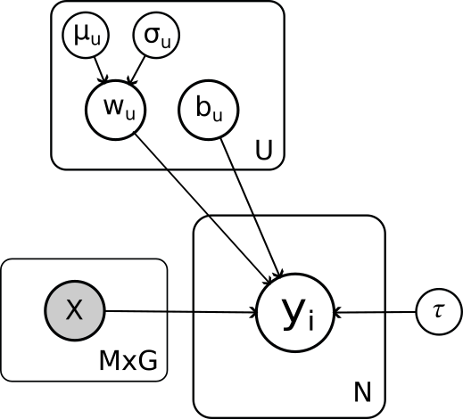 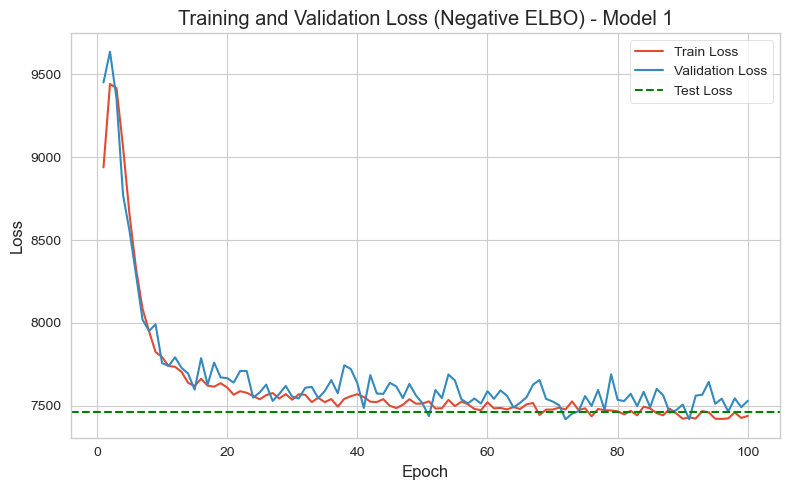

__Skills__: Python, Machine Learning, Probabilistic machine learning, Bayesian statistics, Hierarchical modeling, Regression, Recommender systems, mixture models

## Exploring Probabilistic Techniques in Chan-Vese Segmentation
*Group project for the course: 02506 Advanced Image Analysis* 
Explored probabilistic extensions to the classical Chan-Vese snake-based segmentation algorithm, which struggles when foreground and background don't separate cleanly by mean intensity. Implemented and compared two approaches, an intensity-based method using per-region pixel histograms, and a patch-based method using k-means clustering on local image patches. Tested both against a simple synthetic image and a real, cluttered tiger photo.
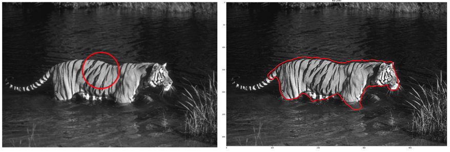
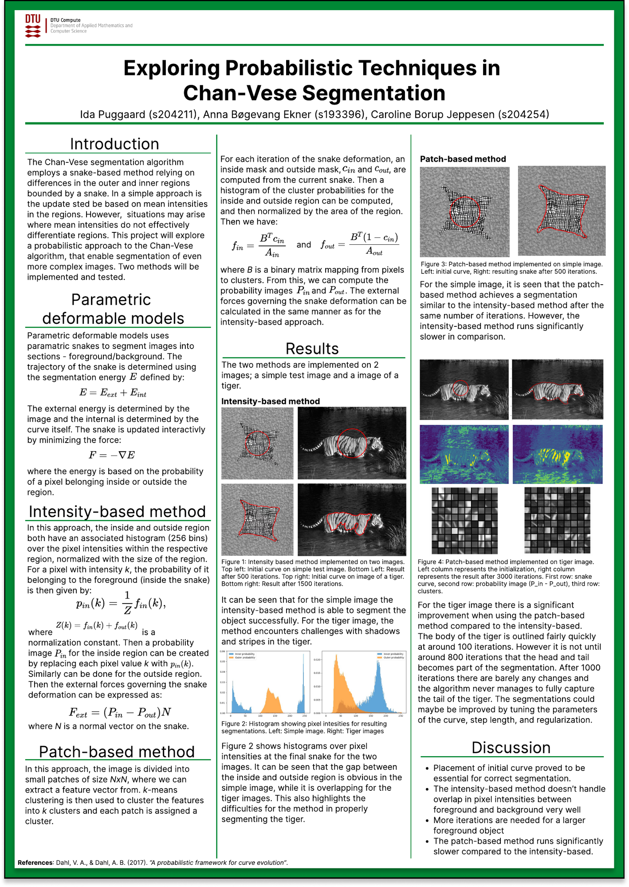

__Skills__: Image analysis, Segmentation, Probabilistic Modelling, K-means Clustering, Image Python
